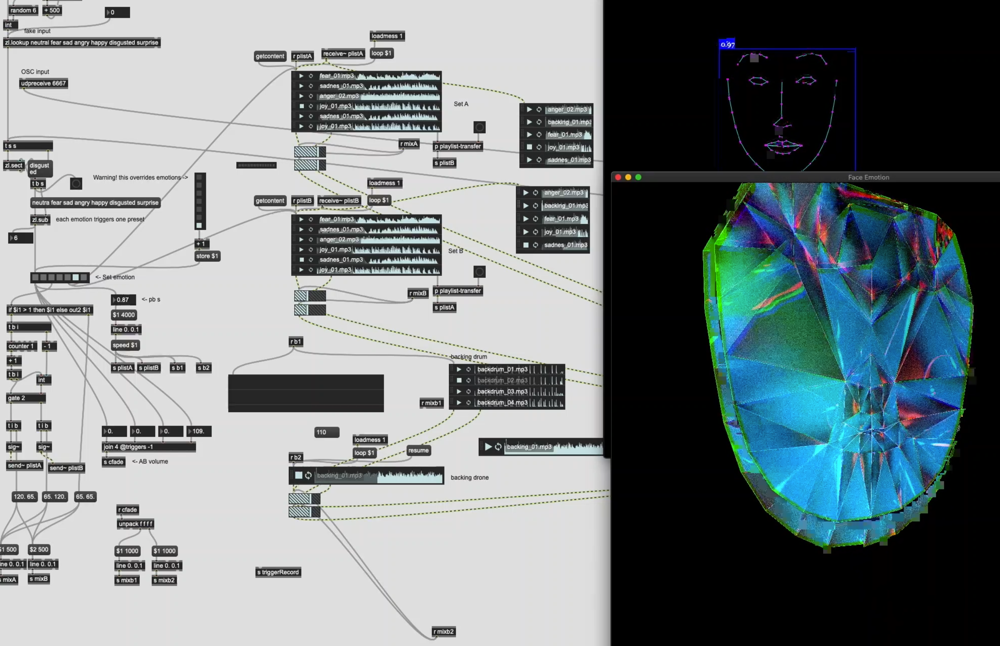

# ArsElectronicaHackathon2020

This is the result of our team   **Humans x AI x SOUND** for the [Ars Electronica Hackathon 2020](https://ars.electronica.art/keplersgardens/en/aixmusic-hackathon/).

## Description





## Controls

```cpp
key == 'g' // ==> show hide the GUI for emotions
key == 'h' // ==> show / hide mouse
key == LEFT_ARROW // ==> show / hide content
key == RIGHT_ARROW // ==> show / hide content
key == 'r' // sends the recording message to maxMSP and flashes screen red
```
