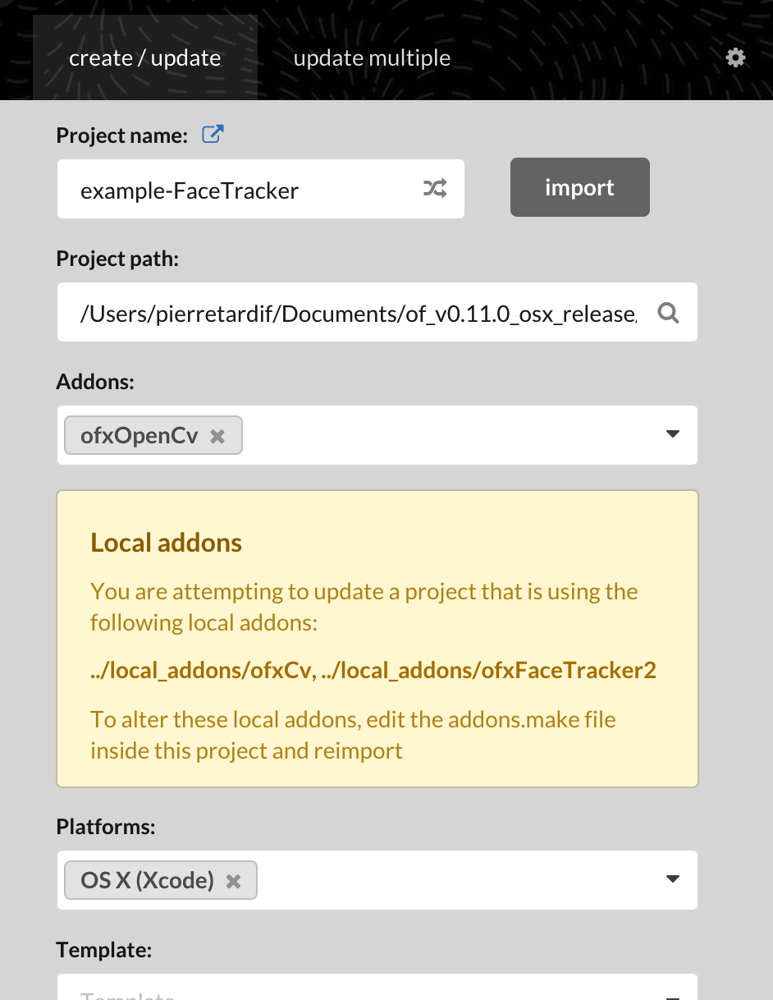
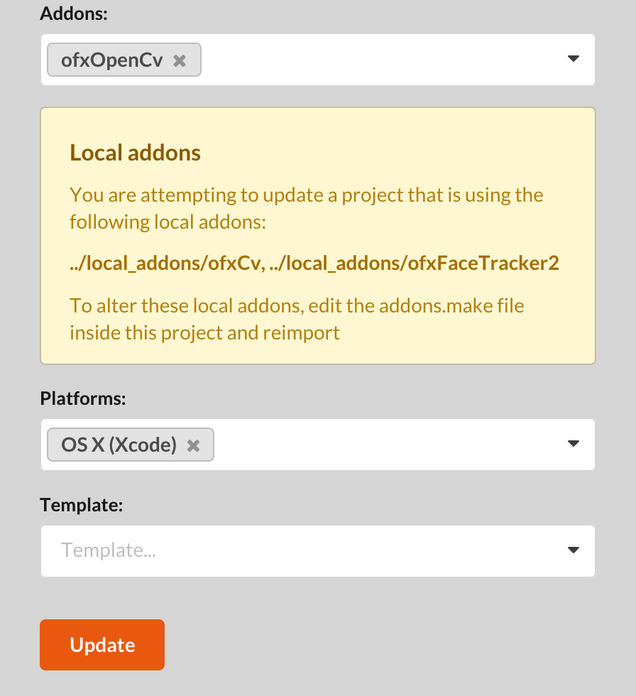

# ArsElectronicaHackathon2020


## Openframeworks Apps

Download Openframeworks from [here](https://openframeworks.cc/download/).
Select your platform, and click download.

Make sure to follow the one step to get it running - installing xCode -.

Then to run the app, clone this repository in your apps folder.

example :
```bash_profile
cd Documents/of_v0.11.0_osx_release/apps/
git clone https://github.com/pierrextardif/ArsElectronicaHackathon2020.git
```

Then  from your OF install, launch the Project Generator.
The Project Generator is situated in the folder called `projectGenerator` in the OF install folder next to the README.md, and the folder other.

Start the project generator app, and select import, then naviguate intp the ArsElectronicaHackathon2020 folder and select the app you want to test.


For example the example-FaceTracker should look like this:



Then click update at the bottom and it should launch xcode.

Then run it from xcode.


## Controls

```cpp
key == 'g' // ==> show hide the GUI for emotions
key == 'h' // ==> show / hide mouse
key == LEFT_ARROW // ==> show / hide content
key == RIGHT_ARROW // ==> show / hide content
key == 'r' // sends the recording message to maxMSP and flashes screen red
```
